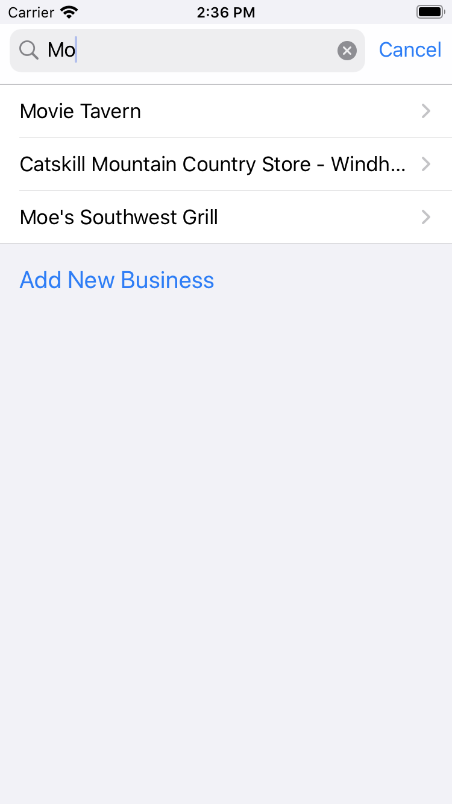
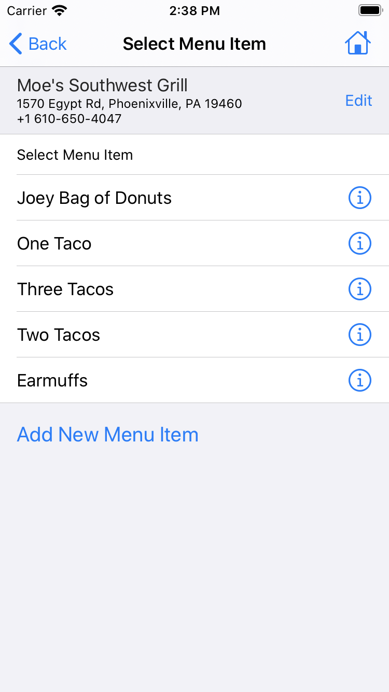
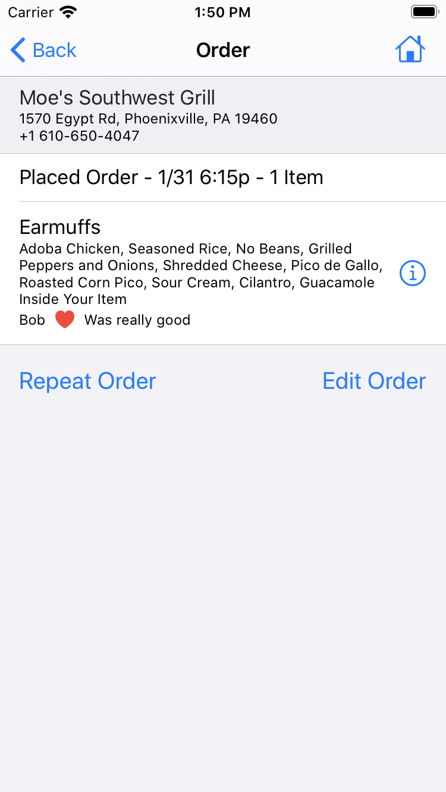
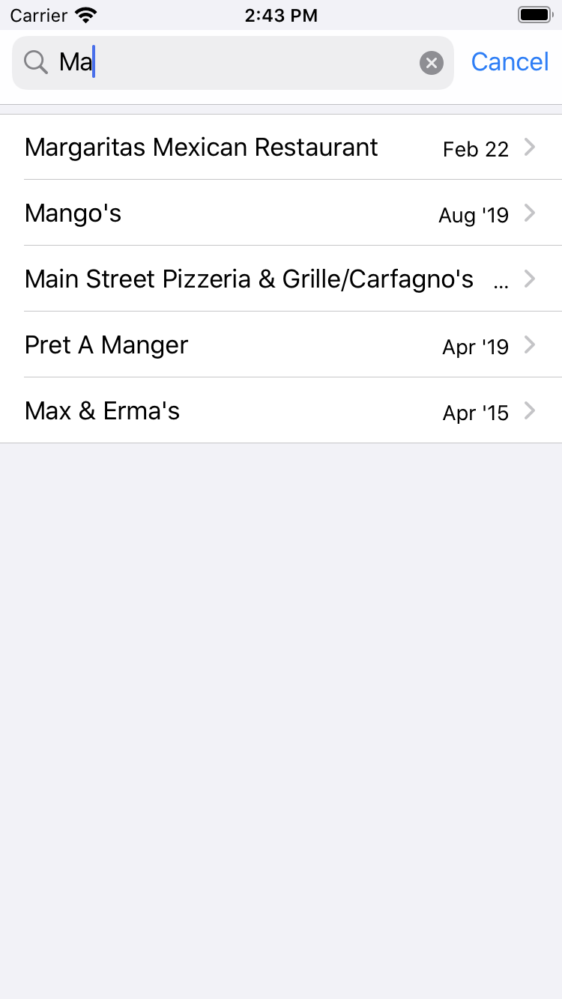

[fork X knife](https://www.forkxknife.com)
========================

## Summary

Nobody likes a bad meal, let alone a bad meal twice! [fork X knife](https://www.forkxknife.com) allows you to track your meals at the restaurants you visit.

Enter your meals as if you were ordering takeout. Then add notes against your meal for the next time.

Search your order history to see when you last visited a place. Review your notes and favorite menu items.

Businesses, locations and menus are community maintained. If your favorite business or location hasn't been added yet, you can add it.

If your favorite menu items haven't been added yet, you can add it. No more having those less than great fish tacos, that you didn't remember you having before.

Happy meals!

## Views

|Home|
|---|

### Start New Order

Find Business|Select Location|Add Location
---|---|--
||

### Choosing Menu Items

Select Item|Add New Item|Customize Item
---|---|--
||

### Reviewing and Placing Order

Review Order|Place Order|Order Placed
---|---|--
||

### Order History

Order History|Search Orders|Business Orders
---|---|---
||

### Authentication

Welcome|Login|Account
---|---|---
||

### Settings

|Settings|
|---|
||
